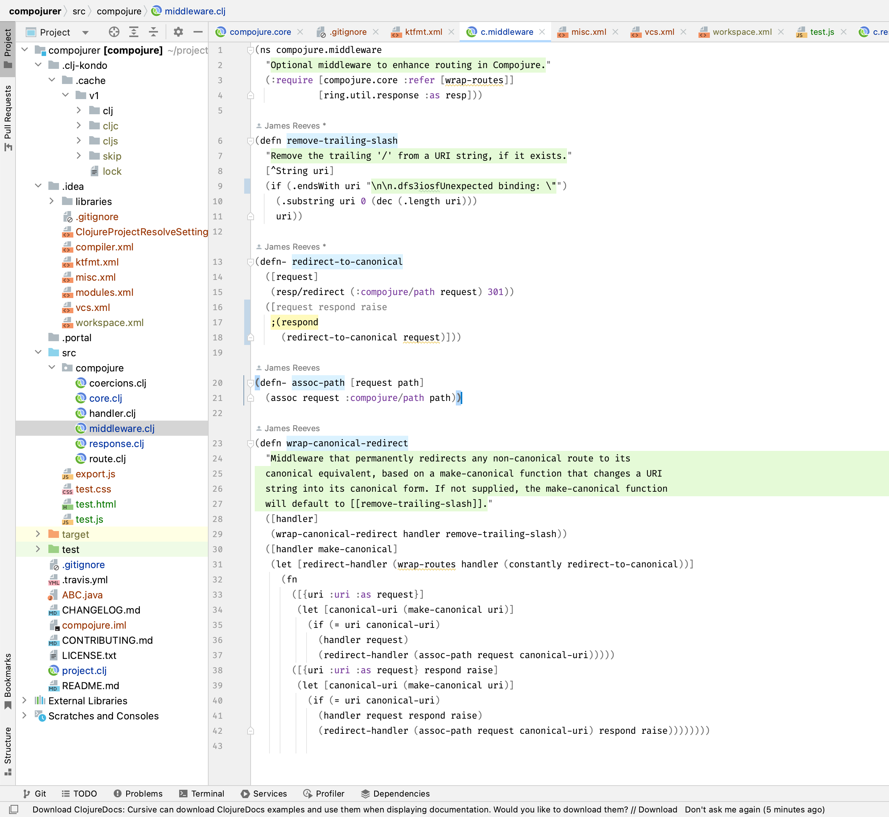
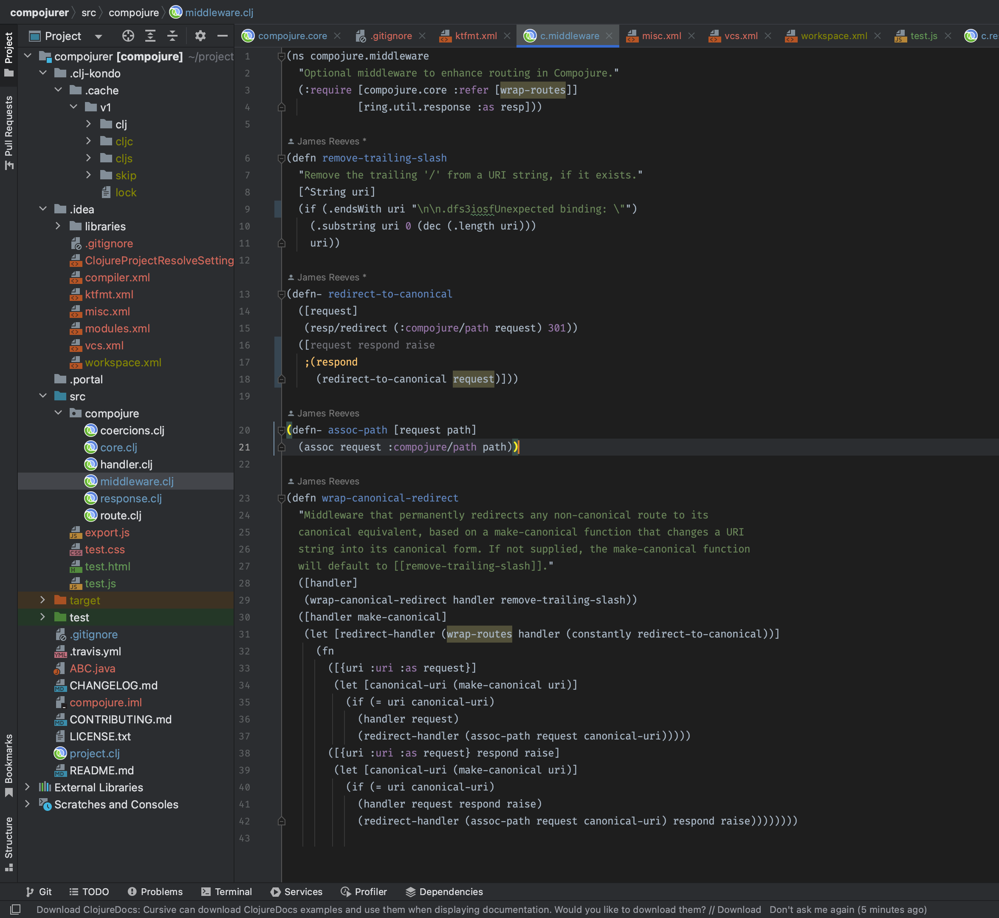

# Alabaster Themes

<!--  -->

<!-- Plugin description -->

Light and dark minimal themes for Jetbrains IDEs based on [tonsky's sublime-scheme-alabaster](https://github.com/tonsky/sublime-scheme-alabaster) with a slight twist.

Themes use Jetbrains' color palette to provide best possible experience and go further in minimalistic approach by highlighting only function declarations and omitting other global definitions. The highlighted items are (all in broad terms):

- **Strings**

- **Constants**

- **Comments**

- **Function declarations**

<!-- Plugin description end -->

## Installation

- Using IDE built-in plugin system:

  <kbd>Settings/Preferences</kbd> > <kbd>Plugins</kbd> > <kbd>Marketplace</kbd> > <kbd>Search for "alabaster-themes"</kbd> >
  <kbd>Install Plugin</kbd>
- Manually:

  Download the [latest release](https://github.com/vlnabatov/alabaster-theme/releases) and install it manually using
  <kbd>Settings/Preferences</kbd> > <kbd>Plugins</kbd> > <kbd>⚙️</kbd> > <kbd>Install plugin from disk...</kbd>

